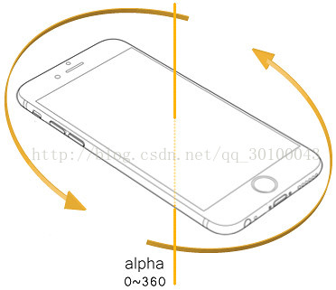
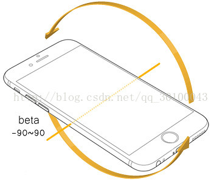
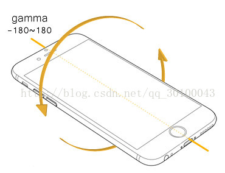

#### HTML5陀螺仪
**概念**：陀螺仪又叫角速度传感器，是不同于加速度计（G-sensor）的，它的测量物理量是偏转、倾斜时的转动角速度。在手机上，仅用加速度计没办法测量或重构出完整的3D动作，测不到转动的动作的，G-sensor只能检测轴向的线性动作。但陀螺仪则可以对转动、偏转的动作做很好的测量，这样就可以精确分析判断出使用者的实际动作。而后根据动作，可以对手机做相应的操作！

可以让document监听deviceorientation 来获取相关的数据，里面包括3个值alpha、beta和gamma。
1. alpha: 移动设备水平放置时，绕z轴旋转的角度，数值为0度到360度

2. beta: 移动设备水平放置时，绕X轴旋转的角度，数值为-180度到180度。

3. gamma: 移动设备水平放置时，绕Y轴旋转的角度，数值为-90度到90度。

**code**
1. deviceorientation 
设备的物理方向信息，表示为一系列本地坐标系的旋角。
2. devicemotion
提供设备的加速信息
3. compassneedscalibration
用于通知web站点使用罗盘信息校准上述事件

**淘宝造物节H5**

#### CSS3 核心高级技巧
**css双飞翼布局（圣杯布局）**
等高：实为假等高
实现三栏布局的方法：position、felx、grid
grid api: https://www.html.cn/archives/8510

盒模型：标准盒模型和怪异盒模型
 css icon -> cssicon.space
 css hint -> css 规范

 ####
 BFC IFC FFC GFC
 BOX: CSS布局的基本单位
 BOX是css布局的对象和基本单位
 * block-level box: display属性为block, list-item, tabel的元素，会生成block-level box。并且参与block formatting context
 * inline-level box: dispaly属性为inline, inline-block, inline-table的元素，会生成inline-level box。并且参与inlie formatting context
 Formatting context是W3C CSS2.1规范中的一个概念。它是页面中的一块渲染区域，并且有一套渲染规则，它决定了其子元素将如何定位，以及和其他元素的关系和相互作用。最常见的Formatting context 有Block formatting context (简称BFC) 和 Inline formatting context(简称IFC)

 **哪些情况下会生成BFC？**
 * 根元素
 * float属性不为none
 * position为absolute或fixed
 * display为inline-block, table-cell, table-caption, flex, inline-flex
 * overflow不为visible
 **BFC原则：**
 BFC就是页面上的一个隔离的独立容器，容器里面的子元素不会影响到外面的元素。反之也如此。
 * 两个BFC之间是独立的
 * 如果生成BFC，浮动元素也跟着计算（清除浮动：为达到清除内部浮动，给父元素添加overflow:hidden生成BFC，那么在计算高度时，父元素内部浮动的子元素也会参与计算）

 **IFC**(Inline Formatting Contexts)直译为“内联格式化上下文”，IFC的line box（线框）高度由其包含行内元素中最高的实际高度计算而来（不受到竖直方向的padding/margin影响）
 **FFC**(Flex Formatting Contexts)直译为“自适应格式化上下文”，display值为flex或者inline-flex的元素将会生成自适应容器（flex container）
 **GFC**(GridLayout Formatting Contexts)直译为“网格布局格式化上下文”，当为一个元素设置display值为grid的时候，此元素将会获得一个独立的渲染区域，我们可以通过在网格容器（grid container）上定义网格定义行（grid definitiong rows）和网格定义列（grid definition columns）属性各在网格项目（grid item）上定义网格行（gird row）和网格列（grid columns）为每一个网格项目（grid item）定义位置和空间。
 **能用一个html实现的布局就不要用两个**
 伪类:after和::after的区别？？？
 img特性：clip-path: polygon() ???

 ####贝塞尔曲线
 http://cubic-bezier.com/#.25,.1,.25,1
 ####animate.css（库）
 ####css矩阵 
 -> 没听懂？？?
 css transform (skew scale rotate translate)原理是matrix
